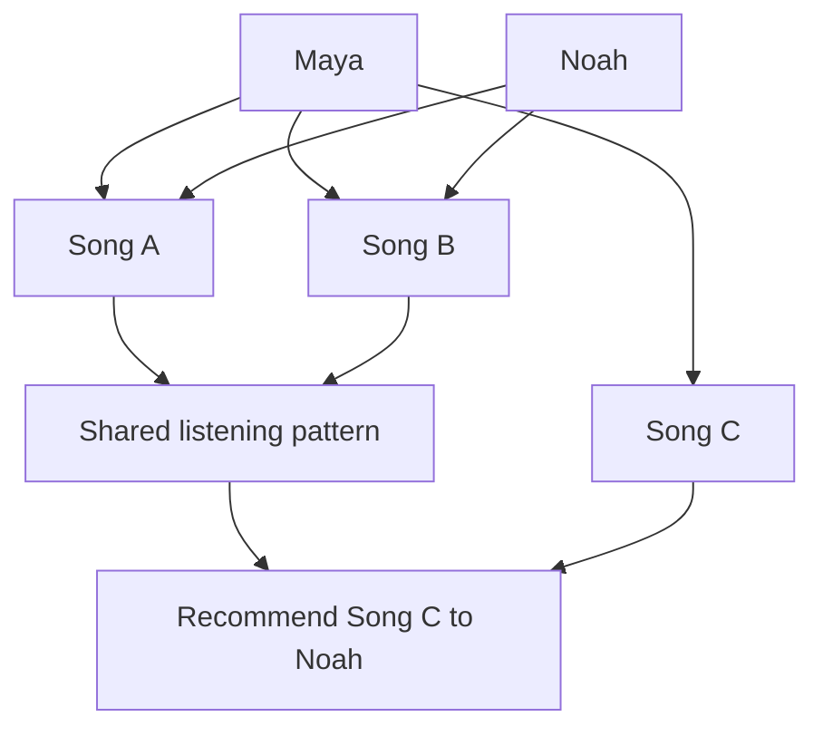
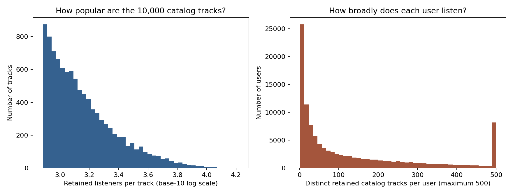
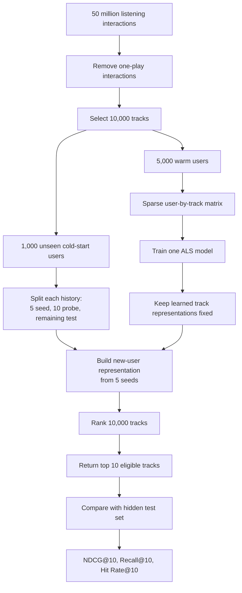
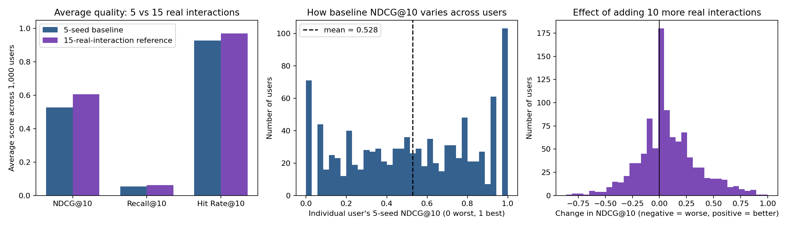

# Music Recommendation Baseline

## 1. Problem

A music recommender ranks songs so that tracks a specific user is likely to
enjoy appear near the top.

This project focuses on the **new-user cold-start problem**. A new user has too
little listening history for the system to understand their taste. We simulate
that situation by showing the recommender only five songs from each evaluation
user's real history.

The goal of this phase is to establish a baseline:

> How well can one recommender perform when it knows only five songs for a new
> user?

The result will become the comparison point for later experiments.

There are several ways to build a recommender. A content-based system could use
genres or tags. A popularity system could recommend the same widely played
songs to everyone. For this baseline, we use collaborative filtering because
the dataset's strongest signal is its large collection of real user listening
histories. It is also a standard personalized recommender against which later
methods can be compared.

## 2. Baseline approach: collaborative filtering

**Collaborative filtering** recommends from patterns shared across many users.
It does not need to know that a song is “rock” or “jazz.” Instead, it learns
that users who listened to some of the same songs often listen to other songs
in common.

For example:

- Maya listened to songs A, B, and C.
- Noah listened to songs A and B.
- Their overlap suggests similar taste.
- The system can recommend song C to Noah.

The real system learns millions of overlapping patterns rather than applying
this rule manually. We use **Alternating Least Squares (ALS)**, a collaborative-
filtering algorithm. ALS converts users and songs into learned numerical
representations. Users and songs with compatible representations receive high
recommendation scores.

Collaborative filtering works well for users with history, but it struggles
with new users. With only five songs, the model has limited evidence about
which established listening patterns fit that person.

## 3. Experiment setup

### Dataset

The project uses Music4All-Onion v2.

| File | Contents |
|---|---|
| `userid_trackid_count.tsv.bz2` | User ID, track ID, and total play count |
| `id_genres_tf-idf.tsv.bz2` | 685 genre features per track |

The genre values do not influence recommendation scores. The preparation step
uses the genre file only to keep tracks that have genre metadata available for
later phases.

Interactions with only one play are removed because a single play may be
accidental.

| Full-dataset quantity | Value |
|---|---:|
| User-track interactions | 50,016,042 |
| Users | 119,140 |
| Tracks appearing in listening data | 56,512 |
| Interactions retained after filtering | 27,056,141 |

### Experiment subset

The baseline uses:

- 10,000 tracks with the most retained listeners;
- 5,000 **warm users** for training;
- 1,000 separate **cold-start users** for evaluation;
- 759,387 retained interactions across the selected users.

Warm users provide the histories from which ALS learns shared listening
patterns. Cold-start users never appear in training, so the model cannot already
know their full histories.

Users with more than 500 catalog interactions are excluded. This prevents a
small number of extremely active listeners from dominating a proof-of-concept
intended to represent more typical users.

### Dataset charts

Each bar in these two histograms counts how many tracks or users fall within a
range. Taller bars mean that range contains more observations.

**Left: listeners per catalog track:**

- The horizontal axis is the number of retained listeners for a track. It uses
  a base-10 logarithmic scale because popularity covers a very wide range. For
  orientation, 3 means about $10^3=1{,}000$ listeners, while 4 means about
  $10^4=10{,}000$ listeners.
- The vertical axis is how many of the 10,000 catalog tracks fall in each
  listener range.
- The tall bars on the left and shrinking bars toward the right mean that many
  tracks have relatively modest audiences and only a few are extremely popular.

**Right: catalog tracks played per user:**

- The horizontal axis is how many distinct retained catalog tracks a user
  played.
- The vertical axis is how many users have that activity level.
- Values are capped at 500 on the chart, so the final bar combines users with
  500 or more tracks. Users above 500 are visible here for context but are
  excluded from the experiment subset.
- The large concentration near the left means most users interacted with a
  relatively small part of the catalog. Fewer users have very broad histories.

Together, the charts show two long-tailed distributions: a small number of
tracks attract unusually large audiences, and a small number of users listen
far more broadly than most users.

### Splitting each evaluation user's history

Every cold-start user has at least 30 retained interactions. Their history is
split into:

- **Seed set:** five real songs shown to the baseline recommender.
- **Probe set:** ten real songs hidden from the baseline and reserved for a
  diagnostic described below.
- **Test set:** all remaining real songs, used as the answer key.

For user $u$, write the full retained history as $I_u$. The split is:

$$
I_u=S_u\cup P_u\cup T_u,
\qquad |S_u|=5,
\qquad |P_u|=10
$$

Here, $S_u$, $P_u$, and $T_u$ are the seed, probe, and test sets. They do not
overlap. This notation makes it explicit that the test answers are not part of
the model input.

The recommender returns ten tracks. A recommendation counts as relevant when it
appears in that user's hidden test set. Seed and probe tracks are removed from
the candidates, so the system cannot receive credit for returning songs already
used as inputs or diagnostics.

This is a retrospective offline experiment. The count file has no timestamps,
so the split cannot reproduce the stronger real-world test of predicting future
listens from past listens.

### Model Configuration & Hyperparameters

The baseline recommender trains an implicit Alternating Least Squares (ALS) model on the warm user matrix using the following experimental parameters:

* **Latent Factors ($F$):** 64
* **Regularization ($\lambda$):** 0.05
* **Confidence Scaling ($\alpha$):** 40.0
* **ALS Training Iterations:** 15
* **Seed Tracks per Cold User:** 5
* **Recommendation List Size ($K$):** 10
* **Warm Training Users:** 5,000
* **Cold Evaluation Users:** 1,000
## 4. System

Training play counts are converted to confidence values:

$$
C_{ui}=1+10\log(1+c_{ui})
$$

Here, $c_{ui}$ is how often user $u$ played track $i$. The logarithm makes more
plays count as stronger evidence without allowing extremely large counts to
dominate.

The ALS model uses 64 learned factors, regularization 0.05, 20 training
iterations, and random seed 11. The factors summarize recurring listening
patterns; they are not manually named genres.

ALS learns a 64-number vector $p_u$ for each training user and a 64-number
vector $q_i$ for each track. Its predicted preference score is their dot
product:

$$
\hat{s}_{ui}=p_u^\mathsf{T}q_i
$$

A larger $\hat{s}_{ui}$ means track $i$ is ranked more highly for user $u$.
This is the mathematical form of matching a user's learned listening pattern
with a track's learned pattern.

For each cold-start user, ALS keeps the trained song representations fixed and
calculates only a new user representation from the five seeds. It then scores
and ranks the catalog.

### The 15-real-interaction reference

We also run a diagnostic using the same trained model with 15 genuine
interactions: the five seeds plus the ten probes.

This is not a second recommender and not a realistic five-song cold-start
baseline. It answers one question:

> Can this model improve when it receives more correct information about the
> new user?

If the answer is yes, later work has measurable room to improve the five-seed
baseline.

## 5. Metrics

All metrics evaluate the top ten recommendations. Higher is better.

Let $R_u^{10}$ be the ten ranked recommendations for user $u$, and let $T_u$ be
that user's hidden test set.

**NDCG@10**, the primary metric, measures ranking quality. Let
$\operatorname{rel}_{u,r}=1$ when the recommendation at rank $r$ belongs to
$T_u$, and 0 otherwise. Then:

$$
\begin{aligned}
\operatorname{DCG@10}_u
&=\sum_{r=1}^{10}\frac{\operatorname{rel}_{u,r}}{\log_2(r+1)} \\
\operatorname{NDCG@10}_u
&=\frac{\operatorname{DCG@10}_u}{\operatorname{IDCG@10}_u}
\end{aligned}
$$

The logarithm gives more credit to correct tracks near rank 1.
$\operatorname{IDCG@10}$ is the best possible DCG for that user, which scales
the result from 0 to 1.

**Recall@10** is the fraction of all hidden test tracks recovered in the top
ten. It is naturally small when a user has many hidden tracks but only ten
recommendation slots.

$$
\operatorname{Recall@10}_u
=\frac{|R_u^{10}\cap T_u|}{|T_u|}
$$

**Hit Rate@10** is the fraction of users who receive at least one relevant track
in their top ten.

$$
\operatorname{Hit@10}_u
=\mathbf{1}\!\left[|R_u^{10}\cap T_u|>0\right]
$$

The reported Hit Rate@10 is the average of this 0-or-1 value across all 1,000
evaluation users.

Each mean includes a 95% confidence interval calculated from 5,000 bootstrap
resamples of the 1,000 evaluation users. This shows uncertainty across users.

## 6. Results

Both rows use the same trained ALS model. Only the number of genuine
interactions revealed for the new user changes.

| Input                                    |    NDCG@10 |               95% CI | Precision@10 |  Recall@10 | Hit Rate@10 |
| ---------------------------------------- | ---------: | -------------------: | -----------: | ---------: | ----------: |
| Global popularity baseline               |     0.1327 |     [0.1226, 0.1424] |       0.1265 |     0.0097 |      0.6150 |
| Five real seeds: **baseline**            | **0.5282** | **[0.5087, 0.5474]** |       0.4962 | **0.0546** |   **0.929** |
| Fifteen real interactions: **reference** |     0.6055 |     [0.5868, 0.6228] |       0.5786 |     0.0625 |       0.970 |

### How to read the results charts

The experiment results appear in the three charts above:

**Left: average quality:** Each cluster of three bars compares the **Global Popularity Baseline** (grey), the **5-Seed ALS Baseline** (blue), and the **15-Real-Interaction Reference** (purple). The horizontal axis lists the metrics (**NDCG@10**, **Recall@10**, and **Hit Rate@10**), and the vertical axis indicates their average score across 1,000 cold-start users. Compare the height of the three bars within each metric group to observe the performance gains from non-personalized to personalized recommendations.

**Middle: baseline differences across users:** the horizontal axis is an
individual user's NDCG@10, from 0 on the left to 1 on the right. The vertical
axis counts users in each score range. The dashed line marks the overall mean,
0.528. The broad spread shows that the baseline works very well for some users
and poorly for others; the average alone hides that variation.

**Right: effect of ten more real interactions:** each user's value is

### Summary of Performance & Metric Comparisons

**Personalization Gain:** The **5-Seed ALS Baseline** achieves an **NDCG@10 of 0.5282**, dramatically outperforming the non-personalized **Global Popularity Baseline** (**0.1327**). A **Hit Rate@10 of 0.929** confirms that 92.9% of cold-start users received at least one relevant track in their top 10 recommendations.

**Precision vs. Recall:** The 5-seed model achieves a **Precision@10 of 0.4962**, meaning roughly half of the top 10 recommended tracks match relevant items in the user's hidden evaluation profile. Recall@10 (**0.0546**) remains lower due to large evaluation catalog sizes per user.

**Headroom Gap:** Providing 10 additional real interactions raises NDCG@10 to **0.6055** (an absolute increase of **+0.0773**, or a **+14.6% relative gain**). This gap defines the headroom available for future augmentation techniques (e.g., content-based metadata) when only 5 initial seeds are known.

$$
\text{15-real-interaction NDCG@10} - \text{5-seed NDCG@10}.
$$

The vertical black line is zero. Bars to its right represent users who improve with ten more real interactions; bars to its left represent users who get worse. The vertical axis counts users. Most of the distribution is on the positive side, but not every user benefits.

The non-personalized Global Popularity Baseline achieves an NDCG@10 of 0.1327 and Precision@10 of 0.1265.

The baseline NDCG@10 is **0.5282** **(a nearly 4× improvement over global popularity)**. **Precision@10 reaches 0.4962, showing that roughly half of top recommendations match relevant hidden user preferences.** Hit Rate@10 of **0.929** means that 92.9% of cold-start users received at least one recommendation found in their hidden history.

The 15-real-interaction reference raises NDCG@10 by **0.0773**, a **14.6%** relative increase **(reaching 0.6055 NDCG@10 and 0.5786 Precision@10)**. Therefore, the trained model can benefit from better information about a new user. The five-seed result leaves measurable room for the next phase.

### Seed Sensitivity Analysis

Looking at the performance as seed count N increases from 1 to 20.

| Seed Count (N) | NDCG@10    | Precision@10 | Hit Rate@10 (%) |
| -------------- | ---------- | ------------ | --------------- |
| 1              | 0.4519     | 0.4122       | 83.6            |
| 3              | 0.5176     | 0.4882       | 92.4            |
| 5              | 0.5546     | 0.5303       | 95.0            |
| 8              | 0.5708     | 0.5482       | 96.1            |
| 10             | 0.5843     | 0.5611       | 96.5            |
| 12             | 0.5898     | 0.5665       | 96.6            |
| 15             | **0.6036** | **0.5789**   | **97.0**        |
| 20             | 0.5975     | 0.5716       | 96.8            |

To examine how cold-start recommendation quality scales with profile history length, the performance was evaluated across varying seed counts ($N \in \{1, 3, 5, 8, 10, 12, 15, 20\}$):

**Steep Onboarding Learning Curve:** A single seed song ($N=1$) raises NDCG@10 to 0.4519, dramatically outperforming non-personalized global popularity (0.1512). Expanding to $N=5$ seed songs increases NDCG@10 to 0.5546 and Precision@10 to 0.5303.

**Diminishing Returns Threshold:** Performance continues to improve up to $N=15$ (NDCG@10 = 0.6036), after which gains plateau. This indicates that 10–12 seed tracks provide sufficient signal for collaborative filtering to map a user into the latent item space effectively.
## 7. Recommendations and next steps

Based on our offline baseline evaluation and seed sensitivity analysis, we outline key takeaways below:

### Product & Onboarding Recommendations
* **Optimal Onboarding Seed Length (3–5 Songs):** Our seed sensitivity experiment shows that moving from 1 to 5 seed songs produces the single largest jump in recommendation quality ($\text{NDCG@10} = 0.4519 \rightarrow 0.5546$). Asking new users for 3 to 5 favorite tracks during onboarding provides sufficient signal to bootstrap collaborative filtering effectively.
* **Avoid Onboarding Fatigue:** Performance plateaus around 10–12 seed songs ($\text{NDCG@10} \approx 0.58$). Requiring more than 5 initial tracks creates unnecessary user friction with diminishing quality returns.

### Technical & Model Improvements
* **Implement a Hybrid Content-Based Model:** Pure collaborative filtering struggles when seed interactions are sparse ($N < 3$). Utilizing the 685 TF-IDF genre features from `id_genres_tf-idf.tsv.bz2` to construct a hybrid recommender will help close the $+0.0773$ NDCG@10 headroom gap.
* **Interaction-Weighting Schemes:** Currently, all seed tracks receive equal weight in the user pseudo-vector. Weighting seed tracks by play counts or implicit confidence scaling can better capture strong user preferences.
* **Evaluate Beyond Accuracy:** Incorporate Novelty (Self-Information) and Catalog Coverage metrics in future phases to ensure recommendations promote long-tail discovery without over-recommending mainstream hits.
## 8. Credits

- **Justin Chen:** Identified a suitable dataset, performed the initial data
  analysis, and documented the dataset's characteristics.
- **Rice Pham:** Engineered the experimental pipeline, fixed training and
  evaluation bugs, and implemented result reporting.
- **Steven Huynh:** Conducted the literature review and contributed to
  algorithm research and development.
